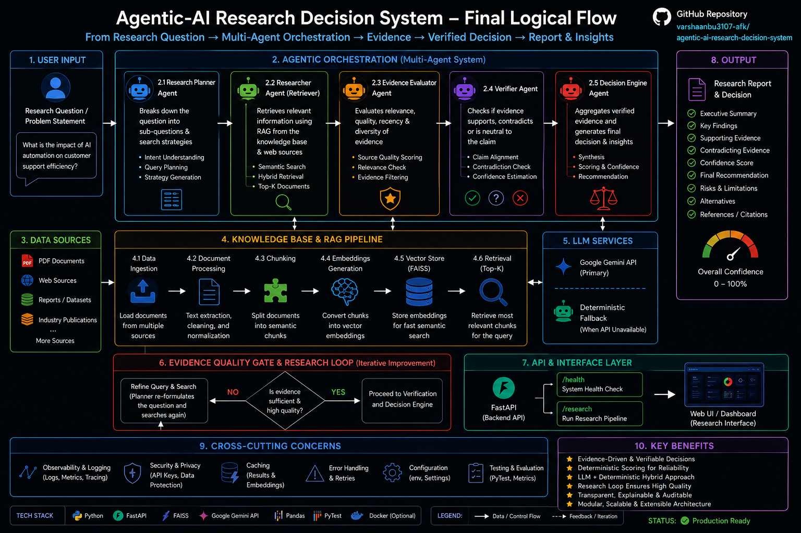

<div align="center">

# 🤖 Agentic AI Research & Decision System

### From Research Questions to Evidence-Backed Decisions

An **agentic AI research system** that decomposes complex questions, performs structured research, retrieves relevant knowledge, evaluates evidence, and produces **verifiable decision-oriented outputs**.

<br/>


</div>

---

## 📌 Overview

Traditional AI applications often answer a question with a single model call.

This project takes a different approach.

The **Agentic AI Research & Decision System** uses a multi-agent architecture where different components are responsible for **planning, researching, retrieving information, evaluating evidence, and making decisions**.

The goal is to transform:

> **Research Question → Structured Research → Evidence → Evaluation → Decision**

The system is designed to make AI-generated decisions more **structured, traceable, and verifiable**.

---

## 🎯 Problem Statement

When solving complex research or decision-making problems, a single LLM response can suffer from:

* Incomplete research
* Unsupported claims
* Hallucinated information
* Lack of evidence traceability
* Poor decomposition of complex questions
* Inconsistent reasoning

This project addresses these limitations by introducing a **multi-agent research pipeline combined with Retrieval-Augmented Generation (RAG)**.

---

## 💡 Solution

The system separates the overall task into specialized stages.

### Core workflow

```text
                    ┌─────────────────────┐
                    │   Research Question │
                    └──────────┬──────────┘
                               │
                               ▼
                    ┌─────────────────────┐
                    │   Planning Agent    │
                    │ Decompose the task  │
                    └──────────┬──────────┘
                               │
                               ▼
                    ┌─────────────────────┐
                    │   Research Agent    │
                    │ Gather information  │
                    └──────────┬──────────┘
                               │
                               ▼
                    ┌─────────────────────┐
                    │   RAG / Retrieval   │
                    │ Relevant knowledge  │
                    └──────────┬──────────┘
                               │
                               ▼
                    ┌─────────────────────┐
                    │  Evidence Analysis  │
                    │ Evaluate findings   │
                    └──────────┬──────────┘
                               │
                               ▼
                    ┌─────────────────────┐
                    │  Decision Agent     │
                    │ Final recommendation│
                    └──────────┬──────────┘
                               │
                               ▼
                    ┌─────────────────────┐
                    │ Evidence-Backed     │
                    │ Decision            │
                    └─────────────────────┘
```

---

## 🏗️ System Architecture

The complete system is organized into multiple components that work together as an agentic research pipeline.



### Architecture Components

| Component               | Responsibility                                         |
| ----------------------- | ------------------------------------------------------ |
| 🧠 **Planner Agent**    | Breaks the research question into structured tasks     |
| 🔎 **Research Agent**   | Performs research and gathers relevant information     |
| 📚 **RAG Pipeline**     | Retrieves relevant information from the knowledge base |
| 🗂️ **Vector Store**    | Stores and searches document embeddings                |
| ⚖️ **Decision Agent**   | Synthesizes evidence and produces a decision           |
| 🎯 **Orchestrator**     | Coordinates communication between agents               |
| 🌐 **API Layer**        | Exposes the system through API endpoints               |
| 🧪 **Evaluation Layer** | Tests system outputs and decision quality              |

---

## 🧠 Multi-Agent Architecture

### 1. Planning Agent

The Planning Agent receives the user's research question and converts it into smaller, manageable research tasks.

**Responsibilities:**

* Understand the research objective
* Decompose complex questions
* Identify required research areas
* Create a structured research plan

---

### 2. Research Agent

The Research Agent executes the research plan and gathers information required to answer the individual research tasks.

**Responsibilities:**

* Execute research tasks
* Collect relevant information
* Organize research findings
* Pass evidence to downstream components

---

### 3. RAG Retrieval

The Retrieval-Augmented Generation layer allows the system to retrieve relevant information from a knowledge base instead of relying entirely on the LLM's internal knowledge.

The project uses **FAISS-based vector search** to identify relevant information.

```text
Documents
    ↓
Chunking
    ↓
Embeddings
    ↓
FAISS Vector Store
    ↓
Similarity Search
    ↓
Relevant Context
    ↓
LLM
```

This helps ground the generated output in retrieved information.

---

### 4. Decision Agent

The Decision Agent is responsible for synthesizing the available evidence and producing the final decision-oriented response.

It considers:

* Research findings
* Retrieved context
* Supporting evidence
* The original research objective

The output is designed to be **structured and evidence-backed** rather than simply generating a free-form answer.

---

## 🔄 End-to-End Workflow

```text
User
 │
 ▼
Research Question
 │
 ▼
Planner Agent
 │
 ├── Research Task 1
 ├── Research Task 2
 └── Research Task 3
 │
 ▼
Research Agent
 │
 ▼
Knowledge Retrieval / RAG
 │
 ▼
Evidence Collection
 │
 ▼
Evidence Evaluation
 │
 ▼
Decision Agent
 │
 ▼
Final Evidence-Backed Decision
```

---

## 📚 RAG Pipeline

The RAG component provides a retrieval layer between the knowledge base and the language model.

### Pipeline

```text
Knowledge Sources
       │
       ▼
Document Processing
       │
       ▼
Text Chunking
       │
       ▼
Embedding Generation
       │
       ▼
FAISS Vector Store
       │
       ▼
Semantic Retrieval
       │
       ▼
Relevant Context
       │
       ▼
LLM Generation
```

### Why RAG?

RAG helps the system:

* Retrieve relevant information dynamically
* Ground responses in available knowledge
* Reduce unsupported generation
* Improve contextual relevance
* Make retrieved evidence available to the decision process

---

## 🧩 Project Structure

```text
agentic-ai-research-decision-system/
│
├── app/
│   ├── agents/
│   │   ├── planner.py
│   │   ├── researcher.py
│   │   ├── verifier.py
│   │   ├── decision.py
│   │   └── test_*.py          # unit tests colocated with each agent
│   │
│   ├── api/
│   │   ├── main.py
│   │   └── test_main.py
│   │
│   ├── core/
│   │   ├── orchestrator.py
│   │   └── test_orchestrator.py
│   │
│   ├── rag/
│   │   ├── loader.py
│   │   ├── chunker.py
│   │   ├── embeddings.py
│   │   ├── ingest.py           # builds the FAISS index from data/documents/research
│   │   ├── vector_store.py
│   │   ├── research_retriever.py
│   │   └── test_research_retriever.py
│   │
│   ├── research/
│   │   ├── evidence.py
│   │   ├── evidence_builder.py
│   │   ├── source_quality.py
│   │   └── test_*.py
│   │
│   └── utils/
│       ├── gemini_client.py
│       └── test_gemini_client.py
│
├── data/
│   ├── documents/research/     # source PDFs used for retrieval
│   ├── vector_store/           # generated by `python -m app.rag.ingest` (gitignored)
│   └── source_registry.json
│
├── docs/
│   ├── architecture.md
│   ├── demo.md
│   └── images/
│       ├── architecture-light.png
│       └── github-banner.png
│
├── evaluation/
│   ├── golden_questions.json
│   ├── golden_dataset.py
│   ├── retrieval_metrics.py
│   ├── evidence_metrics.py
│   └── evaluation_results.json
│
├── .github/
│   └── workflows/
│       └── tests.yml
│
├── .gitignore
├── LICENSE
├── main.py                     # interactive CLI entry point
├── test_retrieval.py           # retrieval-only smoke test
├── README.md
└── requirements.txt
```

> **Note:** a few stray/duplicate paths from an earlier refactor (a second top-level `research/` folder, a top-level `utils/` folder, and a committed `vector_store/` directory at repo root) are not part of the intended structure above and are slated for cleanup — the code only ever reads from `data/documents/research/` and writes to `data/vector_store/`.

---

## 🛠️ Tech Stack

### Programming

* **Python**

### AI / LLM

* Large Language Models
* Multi-Agent Architecture
* Agentic AI
* Prompt-based reasoning

### Retrieval

* **Retrieval-Augmented Generation (RAG)**
* **FAISS**
* Vector embeddings
* Semantic search

### Backend

* **FastAPI**
* REST API
* API-based orchestration

### Development

* Git
* GitHub
* VS Code
* Jupyter Notebook

### Testing & Evaluation

* Automated tests
* Structured evaluation
* Agent-level testing

---

## ⚙️ Installation

### 1. Clone the repository

```bash
git clone https://github.com/varshaanbu3107-afk/agentic-ai-research-decision-system.git
```

```bash
cd agentic-ai-research-decision-system
```

---

### 2. Create a virtual environment

```bash
python -m venv .venv
```

Activate it on Windows:

```bash
.venv\Scripts\activate
```

On macOS/Linux:

```bash
source .venv/bin/activate
```

---

### 3. Install dependencies

```bash
pip install -r requirements.txt
```

---

### 4. Configure environment variables (optional)

Create a `.env` file in the project root:

```env
GEMINI_API_KEY=your_api_key_here
```

Gemini is **optional**. If `GEMINI_API_KEY` is not set, the Planner, Research, Verifier, and Decision agents automatically fall back to deterministic local logic instead of failing.

> Never commit API keys or other secrets to GitHub.

---

### 5. Build the vector store (required before first run)

The FAISS index is generated locally from the PDFs in `data/documents/research/` and is **not** committed to the repository (`data/vector_store/` is gitignored). Before running `main.py`, the API, or `test_retrieval.py` for the first time, build it:

```bash
python -m app.rag.ingest
```

You only need to re-run this when the source documents change.

---

## ▶️ Running the Application

### Run the interactive CLI

```bash
python main.py
```

This will prompt you for a research question and run it through the full pipeline (planning → retrieval → evidence evaluation → verification → decision).

### Run the REST API

```bash
uvicorn app.api.main:app --reload
```

```
GET  /health    → service health check
POST /research  → { "question": "..." } → full research decision
```

### Retrieval-only test

```bash
python test_retrieval.py
```

Loads the persistent vector store and prints retrieved evidence for a sample research question — useful for checking retrieval quality without running the full agent pipeline.

---

## 🧪 Testing

The project includes automated tests for validating system components.

Run:

```bash
pytest
```

The repository also includes a GitHub Actions workflow for automated testing.

---

## 🔬 Evaluation

A major goal of the project is not only to generate answers but also to evaluate the quality of the system's outputs.

Evaluation focuses on areas such as:

* Research quality
* Evidence relevance
* Retrieval performance
* Decision consistency
* Output structure
* Agent behavior

This creates a foundation for measuring and improving the system rather than relying solely on subjective evaluation.

---

## 📊 Example Use Case

### Input

```text
Should a company adopt a particular technology for its business operations?
```

### System Process

```text
Question
   ↓
Planner
   ↓
Identify evaluation criteria
   ↓
Research relevant factors
   ↓
Retrieve supporting knowledge
   ↓
Analyze evidence
   ↓
Compare alternatives
   ↓
Decision Agent
   ↓
Evidence-backed recommendation
```

### Output

The system produces a structured recommendation supported by the research and retrieved evidence.

---

## 🔑 Key Features

* ✅ Multi-agent AI architecture
* ✅ Automated research planning
* ✅ Task decomposition
* ✅ Evidence-oriented research
* ✅ Retrieval-Augmented Generation
* ✅ FAISS vector search
* ✅ API-based orchestration
* ✅ Structured decision generation
* ✅ Automated testing
* ✅ Evaluation framework
* ✅ Modular project architecture

---

## 🎯 Design Goals

The project is designed around four core principles:

### 1. 🔍 Research

Break complex questions into manageable research tasks.

### 2. 📚 Evidence

Ground outputs using retrieved and researched information.

### 3. 🧠 Reasoning

Use specialized agents for different stages of the decision process.

### 4. ✅ Verification

Evaluate outputs and make the decision process more traceable.

---

## 🚀 Future Improvements

Potential improvements include:

* Real-time web research integration
* Source credibility scoring
* Improved evidence verification
* Agent confidence scoring
* More advanced evaluation metrics
* Human-in-the-loop review
* Persistent research memory
* Improved frontend interface
* Multi-source citation management
* Production deployment
* Observability and agent tracing

---

## 📈 What I Learned

Building this project provided hands-on experience with:

* Designing multi-agent systems
* Agent orchestration
* RAG architecture
* Vector databases and semantic retrieval
* API development with FastAPI
* Modular Python application design
* Automated testing
* AI system evaluation
* Designing AI systems around evidence rather than simple generation

---

## 👨‍💻 Author

**Varsani**

B.Tech Information Technology
Data & Automation | AI Systems | Data Analytics

### Connect

* GitHub: [@varshaanbu3107-afk](https://github.com/varshaanbu3107-afk)

---

## 📄 License

This project is licensed under the **MIT License** — see [LICENSE](LICENSE) for details.

---

## ⭐ Support

If you find this project interesting, consider giving the repository a ⭐.

<div align="center">

### 🤖 Research → Evidence → Reasoning → Decision

**Building practical AI systems for real-world problems.**

</div>
